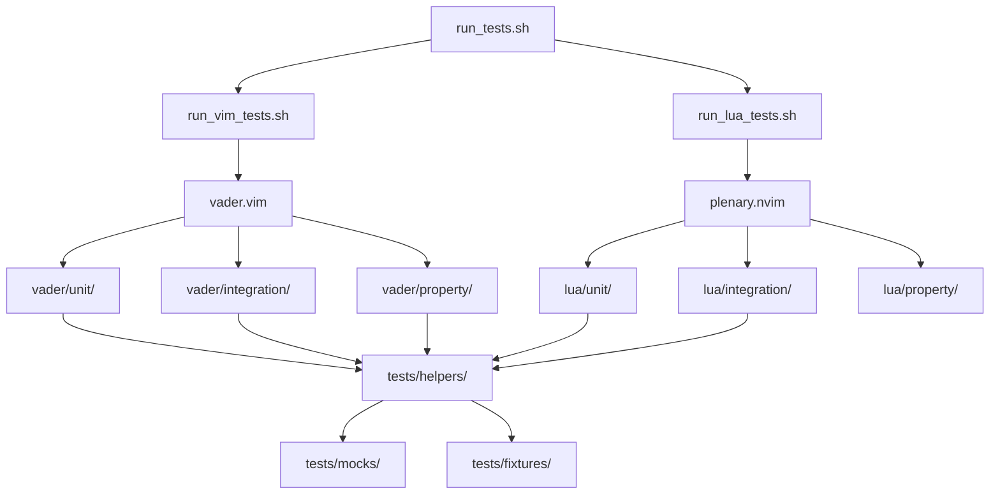

# Design Document: Comprehensive Test Suite for Genero-Tools Plugin

## Overview

This document describes the technical design for a comprehensive, maintainable test suite for the genero-tools Vim/Neovim plugin. The test suite validates all vital features across Vim 7.4, Vim 8.2, Neovim 0.9.x, 0.10.x, and 0.11.x, with a focus on correctness, isolation, and CI/CD integration.

The plugin has two distinct code layers:

- **VimScript layer** (`autoload/genero_tools/`, `plugin/genero_tools.vim`) — core logic, compiler integration, SVN, hints, caching, configuration, keybindings
- **Lua layer** (`lua/genero_tools/`) — Neovim-specific features: async operations, Telescope pickers, nvim-cmp source, Lualine components, snippets, UI helpers

Each layer requires a different test framework. The design uses **vader.vim** for VimScript and **plenary.nvim** for Lua, with shared mock infrastructure and a unified test runner that works locally and in CI.

### Key Design Decisions

1. **Two-framework approach**: vader.vim and plenary.nvim are the de-facto standards for their respective layers. Introducing a single unified framework would require significant custom tooling and would not benefit from community maintenance.

2. **Mock-first external dependencies**: All external processes (`query.sh`, `fglcomp`, `fglform`, `svn`) are replaced with shell script mocks that live in `tests/mocks/`. This makes tests deterministic and fast.

3. **Property-based testing for parsers**: The compiler output parser and SVN diff parser are pure functions with large input spaces. These are the highest-value targets for property-based testing. The VimScript layer uses a custom lightweight generator; the Lua layer uses `plenary`'s built-in facilities.

4. **Isolated Vim instances**: Each test file runs in a fresh Vim/Neovim instance via the test runner, preventing state leakage between test files.

---

## Architecture

### Directory Structure

```
tests/
├── README.md                    # How to run tests
├── run_tests.sh                 # Main test runner (Vim + Neovim)
├── run_vim_tests.sh             # VimScript-only runner (vader.vim)
├── run_lua_tests.sh             # Lua-only runner (plenary.nvim)
│
├── mocks/                       # Mock executables (shell scripts)
│   ├── query.sh                 # Mock genero-tools query backend
│   ├── fglcomp                  # Mock Genero FGL compiler
│   ├── fglform                  # Mock Genero form compiler
│   └── svn                      # Mock SVN client
│
├── fixtures/                    # Static test data
│   ├── 4gl/                     # Sample .4gl source files
│   │   ├── simple.4gl           # Basic function definitions
│   │   ├── module.4gl           # Module with multiple functions
│   │   ├── ambiguous.4gl        # Functions with same name in different modules
│   │   └── large.4gl            # Large file for performance tests
│   ├── per/                     # Sample .per form files
│   │   └── simple.per
│   ├── compiler_output/         # Sample compiler output strings
│   │   ├── errors_v310.txt      # fglcomp 3.10 error format
│   │   ├── warnings_v310.txt    # fglcomp 3.10 warning format
│   │   ├── errors_v320.txt      # fglcomp 3.20 error format
│   │   └── mixed.txt            # Mixed errors and warnings
│   └── svn_diff/                # Sample SVN unified diff output
│       ├── added_lines.diff
│       ├── deleted_lines.diff
│       ├── modified_lines.diff
│       └── mixed_changes.diff
│
├── helpers/                     # Shared test helper VimScript
│   ├── setup.vim                # Common setup/teardown functions
│   ├── assertions.vim           # Custom assertion helpers
│   ├── mock_config.vim          # Config reset helpers
│   └── generators.vim           # Input generators for property tests
│
├── vader/                       # VimScript tests (vader.vim)
│   ├── unit/
│   │   ├── compiler_parser.vader
│   │   ├── svn_parser.vader
│   │   ├── cache.vader
│   │   ├── config.vader
│   │   ├── compat.vader
│   │   ├── hints.vader
│   │   ├── navigation.vader
│   │   ├── keybindings.vader
│   │   └── error_handling.vader
│   ├── integration/
│   │   ├── compiler_quickfix.vader
│   │   ├── compiler_signs.vader
│   │   ├── svn_signs.vader
│   │   ├── unified_signs.vader
│   │   ├── autocompile.vader
│   │   └── feature_interaction.vader
│   └── property/
│       ├── compiler_parser_props.vader
│       ├── svn_parser_props.vader
│       ├── cache_props.vader
│       └── config_validation_props.vader
│
├── lua/                         # Lua tests (plenary.nvim)
│   ├── unit/
│   │   ├── async_spec.lua
│   │   ├── telescope_spec.lua
│   │   ├── cmp_source_spec.lua
│   │   ├── lualine_spec.lua
│   │   ├── snippets_spec.lua
│   │   └── ui_spec.lua
│   ├── integration/
│   │   ├── telescope_integration_spec.lua
│   │   ├── debug_stream_spec.lua
│   │   └── nvim_cmp_integration_spec.lua
│   └── property/
│       └── parser_props_spec.lua
│
└── compat/                      # Version compatibility tests
    ├── vim74_compat.vader
    ├── vim82_compat.vader
    └── neovim_compat.vader
```

### Component Relationships



---

## Components and Interfaces

### Test Runner Scripts

**`tests/run_tests.sh`** — top-level orchestrator

```bash
#!/usr/bin/env bash
# Usage: ./tests/run_tests.sh [--vim-only | --lua-only] [--version <vim|nvim-version>]
# Exits 0 if all tests pass, 1 if any fail.
```

Responsibilities:
- Detect available Vim/Neovim binaries
- Set `PATH` to include `tests/mocks/` so mock executables shadow real ones
- Invoke `run_vim_tests.sh` and `run_lua_tests.sh`
- Aggregate exit codes and produce a summary report

**`tests/run_vim_tests.sh`** — vader.vim runner

```bash
#!/usr/bin/env bash
# Runs all .vader files using: vim -u tests/vimrc -c "Vader! tests/vader/**/*.vader"
# Supports --file <path> for running a single test file
```

**`tests/run_lua_tests.sh`** — plenary.nvim runner

```bash
#!/usr/bin/env bash
# Runs all *_spec.lua files using: nvim --headless -c "PlenaryBustedDirectory tests/lua/"
# Supports --file <path> for running a single spec file
```

**`tests/vimrc`** — minimal Vim config for test execution

```vim
" Minimal vimrc for test execution
set nocompatible
set runtimepath+=.
set runtimepath+=~/.vim/plugged/vader.vim
filetype plugin indent on
syntax on
" Load test helpers
source tests/helpers/setup.vim
source tests/helpers/assertions.vim
source tests/helpers/mock_config.vim
source tests/helpers/generators.vim
```

**`tests/init.lua`** — minimal Neovim config for Lua test execution

```lua
-- Minimal init.lua for plenary test execution
vim.opt.runtimepath:append('.')
vim.opt.runtimepath:append(vim.fn.stdpath('data') .. '/site/pack/test/start/plenary.nvim')
-- Load test helpers
require('tests.helpers.setup')
```

### Mock Executables

All mocks live in `tests/mocks/` and are added to `PATH` before test execution. They are shell scripts that accept the same arguments as the real tools and produce configurable output.

**`tests/mocks/fglcomp`**

```bash
#!/usr/bin/env bash
# Reads MOCK_FGLCOMP_OUTPUT env var for output, MOCK_FGLCOMP_EXIT for exit code.
# Defaults: empty output, exit 0.
echo "${MOCK_FGLCOMP_OUTPUT:-}"
exit "${MOCK_FGLCOMP_EXIT:-0}"
```

**`tests/mocks/fglform`** — same pattern as fglcomp, uses `MOCK_FGLFORM_*` vars

**`tests/mocks/svn`**

```bash
#!/usr/bin/env bash
# Reads MOCK_SVN_OUTPUT, MOCK_SVN_EXIT.
# Supports: svn diff, svn info, svn status
echo "${MOCK_SVN_OUTPUT:-}"
exit "${MOCK_SVN_EXIT:-0}"
```

**`tests/mocks/query.sh`**

```bash
#!/usr/bin/env bash
# Reads MOCK_QUERY_OUTPUT, MOCK_QUERY_EXIT.
# Returns JSON-formatted results matching the real query.sh output format.
echo "${MOCK_QUERY_OUTPUT:-[]}"
exit "${MOCK_QUERY_EXIT:-0}"
```

### Test Helper Modules

**`tests/helpers/setup.vim`** — VimScript setup/teardown

```vim
" Reset plugin state to defaults before each test
function! TestSetup() abort
  " Reset config
  unlet! g:genero_tools_config
  call genero_tools#config#init()
  " Clear caches
  call genero_tools#cache#clear()
  " Close all buffers
  %bdelete!
  " Reset mock env vars
  let $MOCK_FGLCOMP_OUTPUT = ''
  let $MOCK_FGLCOMP_EXIT = '0'
  let $MOCK_FGLFORM_OUTPUT = ''
  let $MOCK_FGLFORM_EXIT = '0'
  let $MOCK_SVN_OUTPUT = ''
  let $MOCK_SVN_EXIT = '0'
  let $MOCK_QUERY_OUTPUT = '[]'
  let $MOCK_QUERY_EXIT = '0'
endfunction

" Clean up after each test
function! TestTeardown() abort
  %bdelete!
  call genero_tools#cache#clear()
  unlet! g:genero_tools_config
endfunction

" Create a temporary .4gl file with given content
function! TestCreateTempFile(content, extension) abort
  let tmpfile = tempname() . '.' . a:extension
  call writefile(split(a:content, "\n"), tmpfile)
  return tmpfile
endfunction

" Delete a temporary file
function! TestDeleteTempFile(path) abort
  if filereadable(a:path)
    call delete(a:path)
  endif
endfunction
```

**`tests/helpers/generators.vim`** — input generators for property tests

```vim
" Generate a random compiler error line in v3.10 format
" Returns: string like "file.4gl:10:5:12:8:error:(-100) message"
function! TestGenCompilerError(seed) abort
  let filenames = ['foo.4gl', 'bar.4gl', 'module/baz.4gl']
  let messages = ['undefined variable', 'type mismatch', 'missing END']
  let severities = ['error', 'warning', 'info']
  let fname = filenames[a:seed % len(filenames)]
  let lnum = (a:seed % 999) + 1
  let col = (a:seed % 79) + 1
  let sev = severities[a:seed % len(severities)]
  let msg = messages[a:seed % len(messages)]
  return fname . ':' . lnum . ':' . col . ':' . lnum . ':' . (col+1) . ':' . sev . ':(-' . (a:seed % 900 + 100) . ') ' . msg
endfunction

" Generate a random SVN unified diff hunk
" Returns: string containing a valid unified diff with known added/deleted lines
function! TestGenSvnDiff(added_lines, deleted_lines) abort
  let lines = []
  call add(lines, 'Index: test.4gl')
  call add(lines, '===================================================================')
  call add(lines, '--- test.4gl	(revision 100)')
  call add(lines, '+++ test.4gl	(working copy)')
  call add(lines, '@@ -1,' . (len(a:deleted_lines) + 5) . ' +1,' . (len(a:added_lines) + 5) . ' @@')
  for i in range(1, 3)
    call add(lines, ' context line ' . i)
  endfor
  for lnum in a:deleted_lines
    call add(lines, '-deleted line ' . lnum)
  endfor
  for lnum in a:added_lines
    call add(lines, '+added line ' . lnum)
  endfor
  return join(lines, "\n")
endfunction
```

**`tests/helpers/assertions.vim`** — custom assertion helpers

```vim
" Assert two values are equal with a descriptive message
function! AssertEqual(expected, actual, msg) abort
  if a:expected != a:actual
    throw 'AssertionError: ' . a:msg . ' — expected ' . string(a:expected) . ' got ' . string(a:actual)
  endif
endfunction

" Assert a list contains an item
function! AssertContains(list, item, msg) abort
  if index(a:list, a:item) == -1
    throw 'AssertionError: ' . a:msg . ' — list does not contain ' . string(a:item)
  endif
endfunction

" Assert a dict has a key
function! AssertHasKey(dict, key, msg) abort
  if !has_key(a:dict, a:key)
    throw 'AssertionError: ' . a:msg . ' — dict missing key ' . a:key
  endif
endfunction
```

### vader.vim Test Structure

Each `.vader` file follows this structure:

```vim
" tests/vader/unit/compiler_parser.vader

Before:
  source tests/helpers/setup.vim
  call TestSetup()

After:
  call TestTeardown()

Execute (parse v310 error line - full format):
  let line = 'foo.4gl:10:5:12:8:error:(-100) undefined variable'
  let result = genero_tools#compiler#parse_v310(line, 'fgl')
  AssertEqual(1, result.success, 'parse should succeed')
  AssertEqual(1, len(result.errors), 'should have 1 error')
  AssertEqual('foo.4gl', result.errors[0].file, 'filename')
  AssertEqual(10, result.errors[0].line, 'line number')
  AssertEqual('error', result.errors[0].severity, 'severity')
```

### plenary.nvim Test Structure

Each `*_spec.lua` file follows this structure:

```lua
-- tests/lua/unit/async_spec.lua
local async = require('genero_tools.async')

describe('genero_tools.async', function()
  before_each(function()
    -- reset state
  end)

  it('parse_output returns success=true for exit_code=0', function()
    local result = async.parse_output({'["result"]'}, {}, 0)
    assert.is_true(result.success)
  end)
end)
```

---

## Data Models

### Compiler Error Entry

```vim
" Produced by genero_tools#compiler#parse_v310()
{
  'file':     string,   " source file path
  'line':     number,   " 1-based line number
  'col':      number,   " 1-based column
  'end_line': number,   " end line (same as line for simple format)
  'end_col':  number,   " end column
  'severity': string,   " 'error' | 'warning' | 'info'
  'message':  string,   " human-readable message
  'code':     string    " error code like '(-100)', may be empty
}
```

### SVN Diff Result

```vim
" Produced by genero_tools#svn#parser#parse_diff()
{
  'added':    [number],  " list of added line numbers
  'modified': [number],  " list of modified line numbers
  'deleted':  [number]   " list of deleted line numbers
}
```

### Cache Entry

```vim
" Stored in g:genero_tools_cache
{
  'value':     any,     " cached value
  'timestamp': number   " unix timestamp of insertion
}
```

### Test Result (internal)

```vim
" Used by test runner to aggregate results
{
  'file':    string,   " test file path
  'passed':  number,   " count of passing tests
  'failed':  number,   " count of failing tests
  'errors':  [string], " list of failure messages
  'version': string    " Vim/Neovim version string
}
```

---

## Correctness Properties

*A property is a characteristic or behavior that should hold true across all valid executions of a system — essentially, a formal statement about what the system should do. Properties serve as the bridge between human-readable specifications and machine-verifiable correctness guarantees.*

The genero-tools plugin contains two pure-function parsers that are ideal candidates for property-based testing: the compiler output parser (`genero_tools#compiler#parse_v310`) and the SVN unified diff parser (`genero_tools#svn#parser#parse_diff`). The caching system and configuration validator also have universal invariants worth specifying as properties.

For VimScript property tests, we use a deterministic loop over a seed range (100 iterations minimum) with the generator functions in `tests/helpers/generators.vim`. For Lua property tests, we use plenary's `busted` with manual iteration.

---

### Property 1: Compiler parser round-trip

*For any* valid compiler error or warning line in v3.10 format (filename, line, col, end_line, end_col, severity, code, message), parsing that line with `genero_tools#compiler#parse_v310` SHALL produce an entry whose `file`, `line`, `col`, `severity`, and `message` fields exactly match the values used to construct the input line.

**Validates: Requirements 4.3, 4.4, 18.1, 18.2**

---

### Property 2: SVN diff parser correctness

*For any* synthetically generated unified diff containing a known set of added and deleted line numbers, `genero_tools#svn#parser#parse_diff` SHALL return `added` and `deleted` lists that exactly match the line numbers embedded in the generated diff.

**Validates: Requirements 9.1, 9.2, 9.3, 18.3**

---

### Property 3: Cache set-get round-trip

*For any* cache key string and serializable value, calling `genero_tools#cache#set(key, entry)` followed immediately by `genero_tools#cache#get(key)` SHALL return an entry whose `value` field equals the original value, provided the TTL has not elapsed.

**Validates: Requirements 14.1, 14.7**

---

### Property 4: Cache size invariant

*For any* sequence of `genero_tools#cache#set` calls on a cache configured with `cache_max_size = N`, the number of entries in `g:genero_tools_cache` SHALL never exceed N.

**Validates: Requirements 14.3**

---

### Property 5: Configuration validation always produces valid state

*For any* configuration dict containing out-of-range or invalid values for `timeout`, `cache_ttl`, `cache_max_size`, `display_mode`, or `compiler_version`, calling `genero_tools#config#validate()` SHALL result in a configuration where all values satisfy their validity constraints (positive numbers, known enum values).

**Validates: Requirements 12.1, 12.2, 12.3, 12.4**

---

### Property 6: Compiler file-type routing

*For any* file path ending in `.4gl`, `.m3`, or `.m4`, `genero_tools#compiler#detect_file_type` SHALL return `'fgl'`. *For any* file path ending in `.per`, it SHALL return `'per'`.

**Validates: Requirements 4.1, 4.2**

---

## Error Handling

### Test Failure Reporting

When a vader.vim test fails, the runner captures the failure message (which includes file, line number, and assertion description) and writes it to a structured log. The log is then parsed by the CI step to produce a JUnit XML report.

When a plenary test fails, plenary's built-in reporter produces TAP output, which is converted to JUnit XML by the CI pipeline.

### Mock Failure Modes

Mocks support two failure modes:

1. **Exit code failure**: Set `MOCK_FGLCOMP_EXIT=1` to simulate compiler not found or crash.
2. **Malformed output**: Set `MOCK_FGLCOMP_OUTPUT` to a string that does not match any known format, to test parser error handling.

Tests that exercise error handling explicitly set these env vars in their `Before:` block and reset them in `After:`.

### Test Isolation Failures

If a test leaves state behind (open buffers, modified globals), subsequent tests may fail with misleading errors. The `TestSetup()` / `TestTeardown()` helpers in `tests/helpers/setup.vim` are called in every `Before:` / `After:` block to prevent this. The test runner also runs each test file in a fresh Vim instance as a second line of defense.

### Version-Specific Failures

Tests that require Neovim-specific APIs (floating windows, `vim.fn.jobstart`, etc.) are guarded with `if has('nvim')` in vader tests and placed in the `tests/lua/` tree for plenary tests. Version-specific failures are reported with the Vim/Neovim version string in the test output.

---

## Testing Strategy

### Framework Selection

| Layer | Framework | Rationale |
|---|---|---|
| VimScript | vader.vim | De-facto standard; supports `Before`/`After` hooks, `Execute`/`Expect` blocks, runs headlessly |
| Lua (Neovim) | plenary.nvim | Built-in to Neovim ecosystem; `busted`-compatible; supports async tests |

### Dual Testing Approach

- **Unit tests** verify specific behaviors with concrete examples: a known compiler output string produces a known parsed result; a specific config value triggers a specific validation error.
- **Property tests** verify universal invariants across many generated inputs: the parser correctly handles any valid input, the cache never exceeds its size limit.

Unit tests focus on:
- Specific error format examples (v3.10 full format, v3.10 simple format, minimal format)
- Integration points (parser → quickfix, parser → signs)
- Edge cases (empty output, malformed lines, binary files)
- Error conditions (compiler not found, SVN not in working copy)

Property tests focus on:
- Parser correctness across the full input space
- Cache invariants under arbitrary operation sequences
- Configuration validation completeness

### Property-Based Testing Implementation

Property tests in VimScript use a deterministic seed loop. Each property test runs **100 iterations minimum**, as required by the quality requirements.

```vim
" Example: compiler_parser_props.vader
Execute (Property 1: compiler parser round-trip — 100 iterations):
  for seed in range(0, 99)
    let line = TestGenCompilerError(seed)
    let result = genero_tools#compiler#parse_v310(line, 'fgl')
    let expected = TestParseExpectedFromSeed(seed)
    AssertEqual(expected.file, result.errors[0].file, 'seed ' . seed . ': file')
    AssertEqual(expected.line, result.errors[0].line, 'seed ' . seed . ': line')
    AssertEqual(expected.severity, result.errors[0].severity, 'seed ' . seed . ': severity')
  endfor
```

Each property test is tagged with a comment referencing the design property:
```vim
" Feature: new-test-suite, Property 1: compiler parser round-trip
```

For Lua property tests in plenary:

```lua
-- Feature: new-test-suite, Property 2: SVN diff parser correctness
it('Property 2: SVN diff parser correctness — 100 iterations', function()
  for seed = 1, 100 do
    local diff, expected = generate_svn_diff(seed)
    local result = vim.fn['genero_tools#svn#parser#parse_diff'](diff)
    assert.are.same(expected.added, result.added)
    assert.are.same(expected.deleted, result.deleted)
  end
end)
```

### Version Compatibility Testing Strategy

The compatibility matrix is tested at two levels:

1. **CI matrix** (GitHub Actions): Each supported version runs the full test suite in a separate job. Version-specific failures are visible in the CI job name.

2. **Compat test files** (`tests/compat/`): These vader files explicitly test the `genero_tools#compat` module functions, verifying that `is_neovim()`, `normalize_display_mode()`, and `get_supported_display_modes()` return correct values for the running version.

### Coverage Reporting

VimScript coverage is approximated by tracking which autoload functions are called during the test run. A post-processing script parses vader output and cross-references it against the list of functions defined in `autoload/`. This produces a line-level coverage estimate.

Lua coverage uses `luacov` (available via LuaRocks), configured to instrument all files under `lua/genero_tools/`. Coverage reports are generated in LCOV format and uploaded to CI artifacts.

Coverage thresholds (enforced in CI):
- Core features (navigation, compiler, cache): 90%+
- Integration features (Telescope, Lualine, nvim-cmp): 80%+
- Error handling: 80%+
- Configuration validation: 100%

### CI/CD Pipeline Design

```yaml
# .github/workflows/tests.yml
name: Test Suite

on: [push, pull_request]

jobs:
  vim-tests:
    strategy:
      matrix:
        vim-version: ['v7.4', 'v8.2']
    runs-on: ubuntu-latest
    steps:
      - uses: actions/checkout@v4
      - name: Install Vim ${{ matrix.vim-version }}
        uses: rhysd/action-setup-vim@v1
        with:
          version: ${{ matrix.vim-version }}
      - name: Install vader.vim
        run: git clone --depth=1 https://github.com/junegunn/vader.vim ~/.vim/plugged/vader.vim
      - name: Run VimScript tests
        run: ./tests/run_vim_tests.sh
      - name: Upload test results
        uses: actions/upload-artifact@v4
        with:
          name: vim-test-results-${{ matrix.vim-version }}
          path: tests/results/

  neovim-tests:
    strategy:
      matrix:
        nvim-version: ['v0.9.5', 'v0.10.4', 'v0.11.0']
    runs-on: ubuntu-latest
    steps:
      - uses: actions/checkout@v4
      - name: Install Neovim ${{ matrix.nvim-version }}
        uses: rhysd/action-setup-vim@v1
        with:
          neovim: true
          version: ${{ matrix.nvim-version }}
      - name: Install plenary.nvim
        run: git clone --depth=1 https://github.com/nvim-lua/plenary.nvim \
               ~/.local/share/nvim/site/pack/test/start/plenary.nvim
      - name: Run Lua tests
        run: ./tests/run_lua_tests.sh
      - name: Run VimScript tests (Neovim)
        run: ./tests/run_vim_tests.sh --neovim
      - name: Upload test results
        uses: actions/upload-artifact@v4
        with:
          name: nvim-test-results-${{ matrix.nvim-version }}
          path: tests/results/

  coverage:
    needs: [vim-tests, neovim-tests]
    runs-on: ubuntu-latest
    steps:
      - uses: actions/checkout@v4
      - name: Download all test results
        uses: actions/download-artifact@v4
      - name: Generate coverage report
        run: ./tests/scripts/generate_coverage.sh
      - name: Check coverage thresholds
        run: ./tests/scripts/check_coverage.sh --min-core 90 --min-integration 80
```

### Test Isolation Mechanism

Each test file is run in a fresh Vim/Neovim instance by the runner scripts. Within a test file, `Before:` / `After:` blocks call `TestSetup()` / `TestTeardown()` to:

1. Reset `g:genero_tools_config` to defaults
2. Clear all caches (`g:genero_tools_cache`, `g:genero_tools_svn_cache`)
3. Close all buffers (`%bdelete!`)
4. Reset mock environment variables
5. Remove any temporary files created during the test

The `PATH` manipulation (prepending `tests/mocks/`) is done at the runner level, not inside individual tests, so it applies uniformly to all tests in a run.

### Test Report Formats

The runner produces two report formats:

1. **Human-readable** (`tests/results/summary.txt`): Pass/fail counts per file, failure messages with file and line references, total time, version matrix summary.

2. **JUnit XML** (`tests/results/junit.xml`): Machine-readable format consumed by GitHub Actions test reporter and other CI tools. Each vader `Execute` block becomes a `<testcase>` element.

TAP output from plenary is converted to JUnit XML by a small Python script (`tests/scripts/tap_to_junit.py`) included in the repository.
