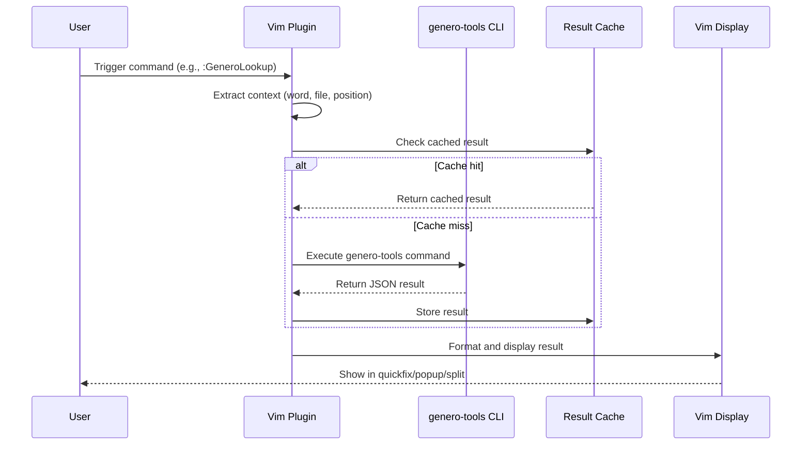

# Design Document: Vim Genero-Tools Plugin

## Overview

A vim plugin that integrates with genero-tools to provide code navigation and lookup capabilities for large-scale Genero codebases (thousands of files, 6M+ LOC). The plugin exposes genero-tools commands through vim commands and keybindings, enabling developers to quickly navigate function definitions, explore module contents, and retrieve metadata without leaving the editor. The plugin is optimized for performance with intelligent caching, asynchronous command execution, and result pagination to handle large result sets efficiently.

## Main Algorithm/Workflow



## Core Interfaces/Types

```vim
" Plugin configuration structure
let g:genero_tools_config = {
  \ 'genero_tools_path': 'genero-tools',
  \ 'cache_enabled': v:true,
  \ 'cache_ttl': 3600,
  \ 'cache_max_size': 100,
  \ 'display_mode': 'quickfix',
  \ 'keybindings_enabled': v:true,
  \ 'timeout': 10000,
  \ 'async_enabled': v:true,
  \ 'result_limit': 1000,
  \ 'pagination_size': 50
  \ }

" Command result structure
let g:genero_result = {
  \ 'success': v:true,
  \ 'data': {},
  \ 'error': '',
  \ 'timestamp': 0
  \ }

" Function definition result
let g:function_def = {
  \ 'name': '',
  \ 'file': '',
  \ 'line': 0,
  \ 'signature': '',
  \ 'module': ''
  \ }

" Module file result
let g:module_file = {
  \ 'path': '',
  \ 'functions': [],
  \ 'author': '',
  \ 'ticket_codes': []
  \ }
```

## Key Functions with Formal Specifications

### Function 1: genero_tools#lookup_function()

```vim
function! genero_tools#lookup_function(function_name, codebase_path)
  " Preconditions:
  "   - function_name is non-empty string
  "   - codebase_path is valid directory path
  "   - genero-tools is installed and accessible
  "
  " Postconditions:
  "   - Returns dict with 'success' key (boolean)
  "   - If success: result.data contains function definition info
  "   - If error: result.error contains descriptive message
  "   - No side effects on input parameters
  "   - Result is cached if cache_enabled is true
  "
  " Loop Invariants: N/A
endfunction
```

**Preconditions:**
- `function_name` is a non-empty string
- `codebase_path` is a valid directory path
- genero-tools is installed and accessible via PATH or configured path
- vim has system() function available

**Postconditions:**
- Returns a dictionary with keys: `success` (boolean), `data` (dict), `error` (string), `timestamp` (number)
- If `success` is true: `data` contains function definition with keys: `name`, `file`, `line`, `signature`, `module`
- If `success` is false: `error` contains descriptive error message
- Result is stored in cache if `g:genero_tools_config.cache_enabled` is true
- No mutations to input parameters

**Loop Invariants:** N/A

### Function 2: genero_tools#list_module_files()

```vim
function! genero_tools#list_module_files(module_name, codebase_path)
  " Preconditions:
  "   - module_name is non-empty string (e.g., 'mymodule.m3')
  "   - codebase_path is valid directory path
  "   - genero-tools is installed
  "
  " Postconditions:
  "   - Returns dict with 'success' key
  "   - If success: result.data is list of file paths in module
  "   - If error: result.error contains message
  "   - Result is cached
  "
  " Loop Invariants: N/A
endfunction
```

**Preconditions:**
- `module_name` is a non-empty string in format 'name.m3'
- `codebase_path` is a valid directory path
- genero-tools is installed and accessible

**Postconditions:**
- Returns dictionary with `success`, `data`, `error`, `timestamp` keys
- If `success` is true: `data` is a list of file paths (strings)
- If `success` is false: `error` contains descriptive message
- Result is cached if enabled
- No mutations to input parameters

**Loop Invariants:** N/A

### Function 3: genero_tools#list_functions_in_file()

```vim
function! genero_tools#list_functions_in_file(file_path, codebase_path)
  " Preconditions:
  "   - file_path is non-empty string pointing to valid file
  "   - codebase_path is valid directory path
  "   - genero-tools is installed
  "
  " Postconditions:
  "   - Returns dict with 'success' key
  "   - If success: result.data is list of function objects
  "   - Each function object has: name, line, signature
  "   - If error: result.error contains message
  "   - Result is cached
  "
  " Loop Invariants: N/A
endfunction
```

**Preconditions:**
- `file_path` is a non-empty string pointing to a valid file
- `codebase_path` is a valid directory path
- genero-tools is installed and accessible

**Postconditions:**
- Returns dictionary with `success`, `data`, `error`, `timestamp` keys
- If `success` is true: `data` is a list of function dictionaries, each with keys: `name`, `line`, `signature`
- If `success` is false: `error` contains descriptive message
- Result is cached if enabled
- No mutations to input parameters

**Loop Invariants:** N/A

### Function 4: genero_tools#get_function_signature()

```vim
function! genero_tools#get_function_signature(function_name, codebase_path)
  " Preconditions:
  "   - function_name is non-empty string
  "   - codebase_path is valid directory path
  "   - genero-tools is installed
  "
  " Postconditions:
  "   - Returns dict with 'success' key
  "   - If success: result.data.signature is string with function signature
  "   - If error: result.error contains message
  "   - Result is cached
  "
  " Loop Invariants: N/A
endfunction
```

**Preconditions:**
- `function_name` is a non-empty string
- `codebase_path` is a valid directory path
- genero-tools is installed and accessible

**Postconditions:**
- Returns dictionary with `success`, `data`, `error`, `timestamp` keys
- If `success` is true: `data.signature` is a string containing the function signature
- If `success` is false: `error` contains descriptive message
- Result is cached if enabled
- No mutations to input parameters

**Loop Invariants:** N/A

### Function 5: genero_tools#get_file_metadata()

```vim
function! genero_tools#get_file_metadata(file_path, codebase_path)
  " Preconditions:
  "   - file_path is non-empty string pointing to valid file
  "   - codebase_path is valid directory path
  "   - genero-tools is installed
  "
  " Postconditions:
  "   - Returns dict with 'success' key
  "   - If success: result.data contains metadata dict with keys:
  "     author, ticket_codes, created_date, modified_date
  "   - If error: result.error contains message
  "   - Result is cached
  "
  " Loop Invariants: N/A
endfunction
```

**Preconditions:**
- `file_path` is a non-empty string pointing to a valid file
- `codebase_path` is a valid directory path
- genero-tools is installed and accessible

**Postconditions:**
- Returns dictionary with `success`, `data`, `error`, `timestamp` keys
- If `success` is true: `data` contains metadata dictionary with keys: `author`, `ticket_codes` (list), `created_date`, `modified_date`
- If `success` is false: `error` contains descriptive message
- Result is cached if enabled
- No mutations to input parameters

**Loop Invariants:** N/A

### Function 6: genero_tools#execute_command()

```vim
function! genero_tools#execute_command(command, args, codebase_path)
  " Preconditions:
  "   - command is non-empty string (e.g., 'lookup', 'list-files')
  "   - args is dict with command-specific arguments
  "   - codebase_path is valid directory path
  "   - genero-tools is installed
  "
  " Postconditions:
  "   - Returns dict with 'success', 'data', 'error', 'timestamp' keys
  "   - Executes genero-tools CLI with proper argument formatting
  "   - Parses JSON output from genero-tools
  "   - Returns error if command fails or times out
  "   - No side effects on input parameters
  "
  " Loop Invariants: N/A
endfunction
```

**Preconditions:**
- `command` is a non-empty string matching genero-tools command names
- `args` is a dictionary with command-specific arguments
- `codebase_path` is a valid directory path
- genero-tools is installed and accessible
- vim has system() function available

**Postconditions:**
- Returns dictionary with `success`, `data`, `error`, `timestamp` keys
- If `success` is true: `data` contains parsed JSON output from genero-tools
- If `success` is false: `error` contains descriptive error message (timeout, command not found, invalid JSON, etc.)
- Command execution respects `g:genero_tools_config.timeout` setting
- No mutations to input parameters

**Loop Invariants:** N/A

### Function 7: genero_tools#display_result()

```vim
function! genero_tools#display_result(result, display_mode)
  " Preconditions:
  "   - result is dict with 'success', 'data', 'error' keys
  "   - display_mode is one of: 'quickfix', 'popup', 'split', 'echo'
  "   - vim is in normal mode or command mode
  "
  " Postconditions:
  "   - Displays result in vim using specified display_mode
  "   - If success: shows formatted data
  "   - If error: shows error message
  "   - Does not modify buffer content
  "   - Returns 0 on success, 1 on error
  "
  " Loop Invariants: N/A
endfunction
```

**Preconditions:**
- `result` is a dictionary with keys: `success`, `data`, `error`
- `display_mode` is one of: `'quickfix'`, `'popup'`, `'split'`, `'echo'`
- vim is in a state where display operations are allowed

**Postconditions:**
- Displays result in vim using the specified display mode
- If `success` is true: displays formatted data appropriately for the mode
- If `success` is false: displays error message
- Does not modify current buffer content
- Returns 0 on successful display, 1 on error
- No mutations to input parameters

**Loop Invariants:** N/A

### Function 8: genero_tools#cache_get()

```vim
function! genero_tools#cache_get(key)
  " Preconditions:
  "   - key is non-empty string
  "   - cache_enabled is true in config
  "
  " Postconditions:
  "   - Returns cached result if key exists and not expired
  "   - Returns empty dict if key not found or expired
  "   - Respects cache_ttl from config
  "   - No side effects
  "
  " Loop Invariants: N/A
endfunction
```

**Preconditions:**
- `key` is a non-empty string
- `g:genero_tools_config.cache_enabled` is true

**Postconditions:**
- Returns cached result dictionary if key exists and TTL not exceeded
- Returns empty dictionary if key not found or TTL expired
- Respects `g:genero_tools_config.cache_ttl` setting (in seconds)
- No mutations to cache or input parameters

**Loop Invariants:** N/A

### Function 9: genero_tools#cache_set()

```vim
function! genero_tools#cache_set(key, value)
  " Preconditions:
  "   - key is non-empty string
  "   - value is dict with result data
  "   - cache_enabled is true in config
  "
  " Postconditions:
  "   - Stores value in cache with key
  "   - Sets timestamp to current time
  "   - Returns 0 on success
  "   - No side effects on input parameters
  "
  " Loop Invariants: N/A
endfunction
```

**Preconditions:**
- `key` is a non-empty string
- `value` is a dictionary with result data
- `g:genero_tools_config.cache_enabled` is true

**Postconditions:**
- Stores `value` in cache with `key`
- Sets timestamp to current time (localtime())
- Returns 0 on success, 1 on error
- No mutations to input parameters

**Loop Invariants:** N/A

## Algorithmic Pseudocode

### Main Lookup Algorithm

```pascal
ALGORITHM lookupFunction(functionName, codebasePath)
INPUT: functionName (string), codebasePath (string)
OUTPUT: result (dict with success, data, error, timestamp)

BEGIN
  ASSERT functionName ≠ ∅
  ASSERT codebasePath is valid directory
  
  // Step 1: Check cache
  cacheKey ← "lookup:" + functionName
  cachedResult ← cacheGet(cacheKey)
  
  IF cachedResult ≠ ∅ THEN
    RETURN cachedResult
  END IF
  
  // Step 2: Build command
  command ← "lookup"
  args ← {function: functionName, codebase: codebasePath}
  
  // Step 3: Execute genero-tools
  result ← executeCommand(command, args, codebasePath)
  
  // Step 4: Cache result if successful
  IF result.success = true THEN
    cacheSet(cacheKey, result)
  END IF
  
  // Step 5: Return result
  RETURN result
END
```

**Preconditions:**
- functionName is non-empty string
- codebasePath is valid directory path
- genero-tools is installed and accessible

**Postconditions:**
- Returns result dictionary with success, data, error, timestamp keys
- If successful: data contains function definition information
- If error: error contains descriptive message
- Result is cached if cache is enabled and operation succeeded

**Loop Invariants:** N/A

### Command Execution Algorithm

```pascal
ALGORITHM executeCommand(command, args, codebasePath)
INPUT: command (string), args (dict), codebasePath (string)
OUTPUT: result (dict with success, data, error, timestamp)

BEGIN
  ASSERT command ≠ ∅
  ASSERT args is dict
  ASSERT codebasePath is valid directory
  
  // Step 1: Build command line
  toolPath ← getGeneroToolsPath()
  cmdLine ← toolPath + " " + command
  
  // Step 2: Add arguments
  FOR each key, value IN args DO
    cmdLine ← cmdLine + " --" + key + " " + escapeArg(value)
  END FOR
  
  // Step 3: Execute with timeout
  startTime ← currentTime()
  timeout ← getConfigValue("timeout")
  
  TRY
    output ← executeSystemCommand(cmdLine, timeout)
    elapsed ← currentTime() - startTime
    
    // Step 4: Parse JSON output
    data ← parseJSON(output)
    
    // Step 5: Build result
    result ← {
      success: true,
      data: data,
      error: "",
      timestamp: currentTime()
    }
    
  CATCH TimeoutException THEN
    result ← {
      success: false,
      data: {},
      error: "Command timed out after " + timeout + "ms",
      timestamp: currentTime()
    }
    
  CATCH JSONParseException THEN
    result ← {
      success: false,
      data: {},
      error: "Invalid JSON response from genero-tools",
      timestamp: currentTime()
    }
    
  CATCH Exception e THEN
    result ← {
      success: false,
      data: {},
      error: "Command execution failed: " + e.message,
      timestamp: currentTime()
    }
  END TRY
  
  RETURN result
END
```

**Preconditions:**
- command is non-empty string matching genero-tools command names
- args is a dictionary with command-specific arguments
- codebasePath is valid directory path
- genero-tools is installed and accessible

**Postconditions:**
- Returns result dictionary with success, data, error, timestamp keys
- If successful: data contains parsed JSON output from genero-tools
- If error: error contains descriptive error message
- Command execution respects timeout setting
- No mutations to input parameters

**Loop Invariants:**
- All arguments have been properly escaped and added to command line

### Display Result Algorithm

```pascal
ALGORITHM displayResult(result, displayMode)
INPUT: result (dict), displayMode (string)
OUTPUT: status (0 for success, 1 for error)

BEGIN
  ASSERT result is dict with success, data, error keys
  ASSERT displayMode IN {quickfix, popup, split, echo}
  
  // Step 1: Format result based on success
  IF result.success = true THEN
    formattedOutput ← formatSuccessData(result.data)
  ELSE
    formattedOutput ← formatErrorMessage(result.error)
  END IF
  
  // Step 2: Display based on mode
  SWITCH displayMode
    CASE "quickfix":
      populateQuickfixList(formattedOutput)
      openQuickfixWindow()
      
    CASE "popup":
      IF isNeovim() THEN
        createPopupWindow(formattedOutput)
      ELSE
        echoMessage(formattedOutput)
      END IF
      
    CASE "split":
      createSplitWindow(formattedOutput)
      
    CASE "echo":
      echoMessage(formattedOutput)
  END SWITCH
  
  RETURN 0
END
```

**Preconditions:**
- result is a dictionary with keys: success, data, error
- displayMode is one of: 'quickfix', 'popup', 'split', 'echo'
- vim is in a state where display operations are allowed

**Postconditions:**
- Displays result in vim using the specified display mode
- If success is true: displays formatted data
- If success is false: displays error message
- Does not modify current buffer content
- Returns 0 on successful display, 1 on error

**Loop Invariants:** N/A

## Example Usage

```vim
" Example 1: Lookup function definition
let result = genero_tools#lookup_function('myFunction', '/path/to/codebase')
if result.success
  echo "Found at: " . result.data.file . ":" . result.data.line
else
  echo "Error: " . result.error
endif

" Example 2: List functions in file
let functions = genero_tools#list_functions_in_file('myfile.4gl', '/path/to/codebase')
if functions.success
  for func in functions.data
    echo func.name . " at line " . func.line
  endfor
endif

" Example 3: Get function signature
let sig = genero_tools#get_function_signature('myFunction', '/path/to/codebase')
if sig.success
  echo "Signature: " . sig.data.signature
endif

" Example 4: Get file metadata
let meta = genero_tools#get_file_metadata('myfile.4gl', '/path/to/codebase')
if meta.success
  echo "Author: " . meta.data.author
  echo "Tickets: " . join(meta.data.ticket_codes, ', ')
endif

" Example 5: Display result in quickfix
let result = genero_tools#lookup_function('myFunction', '/path/to/codebase')
call genero_tools#display_result(result, 'quickfix')

" Example 6: Cache operations
let cacheKey = 'lookup:myFunction'
let cached = genero_tools#cache_get(cacheKey)
if empty(cached)
  let result = genero_tools#lookup_function('myFunction', '/path/to/codebase')
  call genero_tools#cache_set(cacheKey, result)
else
  let result = cached
endif
```

## Correctness Properties

*A property is a characteristic or behavior that should hold true across all valid executions of a system—essentially, a formal statement about what the system should do. Properties serve as the bridge between human-readable specifications and machine-verifiable correctness guarantees.*

### Property 1: Result Structure Consistency

For any command execution, the result dictionary SHALL always contain the keys: success, data, error, and timestamp.

**Validates: Requirement 16.1**

### Property 2: Successful Results Have Data

For any successful command execution, the result.data field SHALL be non-empty and the result.error field SHALL be empty.

**Validates: Requirements 16.2, 16.5**

### Property 3: Failed Results Have Error Message

For any failed command execution, the result.error field SHALL be non-empty and the result.data field SHALL be an empty dictionary.

**Validates: Requirements 16.3, 16.6**

### Property 4: Function Lookup Returns Complete Information

For any function lookup, if successful, the result.data SHALL contain the function name, file path, line number, and signature.

**Validates: Requirement 1.2**

### Property 5: Function List Contains Required Fields

For any function listing, each function in the result.data list SHALL contain the name, line number, and signature fields.

**Validates: Requirement 3.2**

### Property 6: Module File List Returns Paths

For any module file listing, the result.data SHALL be a list of file paths.

**Validates: Requirement 2.2**

### Property 7: File Metadata Contains All Fields

For any file metadata retrieval, if successful, the result.data SHALL contain author, ticket_codes, created_date, and modified_date fields.

**Validates: Requirement 5.2**

### Property 8: Cache Returns Identical Results Within TTL

For any cached result, if the TTL has not expired, cache_get(key) SHALL return the same value as the original result stored by cache_set(key, value).

**Validates: Requirement 6.2**

### Property 9: Expired Cache Entries Are Not Returned

For any cached result, if the elapsed time since cache_set exceeds the configured cache_ttl, cache_get(key) SHALL return an empty dictionary.

**Validates: Requirement 6.3**

### Property 10: Display Operations Do Not Modify Buffer

For any display operation, the current buffer content before calling display_result(result, mode) SHALL be identical to the buffer content after the call.

**Validates: Requirements 7.5, 8.4, 9.3, 10.4**

### Property 11: Command Execution Respects Timeout

For any command execution, if the execution time exceeds the configured timeout value, the command SHALL be terminated and a timeout error SHALL be returned.

**Validates: Requirement 15.2**

### Property 12: Argument Escaping Preserves Semantics

For any command execution with special characters in arguments, the escaped arguments SHALL be correctly interpreted by genero-tools without syntax errors.

**Validates: Requirement 15.1**

### Property 13: Configuration Settings Are Applied

For any configuration setting in g:genero_tools_config, the plugin behavior SHALL reflect that setting when commands are executed.

**Validates: Requirement 11.1**

### Property 14: Vim and Neovim Compatibility

For any command execution, the result and behavior SHALL be identical whether running in vim or neovim, with appropriate fallbacks for unsupported display modes.

**Validates: Requirements 14.1, 14.5**

### Property 15: Codebase Path Is Included in Commands

For any command execution, the configured codebase_path SHALL be included in the command arguments passed to genero-tools.

**Validates: Requirements 1.5, 2.5, 3.5, 4.5, 5.5**

## Plugin Architecture

### File Structure

```
plugin/
  genero_tools.vim          # Main plugin entry point
autoload/
  genero_tools.vim          # Core functionality (lookup, list, etc.)
  genero_tools/
    cache.vim               # Caching logic
    display.vim             # Display/UI logic
    command.vim             # Command execution logic
    config.vim              # Configuration management
doc/
  genero_tools.txt          # Help documentation
```

### Command Interface

```vim
" User-facing commands
:GeneroLookup [function_name]           " Lookup function definition
:GeneroListModuleFiles [module_name]    " List files in module
:GeneroListFunctions [file_path]        " List functions in file
:GeneroFunctionSignature [function_name] " Get function signature
:GeneroFileMetadata [file_path]         " Get file metadata
:GeneroClearCache                       " Clear result cache
:GeneroConfigShow                       " Show current configuration
```

### Keybindings (Optional)

```vim
" Default keybindings (can be disabled via config)
nnoremap <leader>gl :GeneroLookup <C-R><C-W><CR>
nnoremap <leader>gf :GeneroListFunctions %<CR>
nnoremap <leader>gs :GeneroFunctionSignature <C-R><C-W><CR>
nnoremap <leader>gm :GeneroFileMetadata %<CR>
```

## Error Handling

### Error Scenarios

1. **genero-tools not found**: Return error with installation instructions
2. **Invalid codebase path**: Return error indicating path doesn't exist
3. **Command timeout**: Return error with timeout value (critical for large codebases)
4. **Invalid JSON response**: Return error indicating malformed response
5. **Function/file not found**: Return error with search details
6. **Permission denied**: Return error indicating access issue
7. **Result set too large**: Return error with pagination guidance
8. **Cache memory exceeded**: Evict oldest entries using LRU strategy

### Recovery Strategies

- Retry with exponential backoff for transient failures
- Fall back to echo display if popup not available
- Clear cache on repeated failures or memory pressure
- Provide helpful error messages with suggestions
- Implement result pagination for large result sets
- Use LRU cache eviction to prevent memory bloat
- Suggest narrowing search criteria for large codebases

## Testing Strategy

### Unit Testing Approach

- Test each function independently with mocked genero-tools output
- Test cache hit/miss scenarios with large result sets
- Test error handling for various failure modes
- Test display formatting for different result types
- Test configuration loading and validation
- Test pagination logic with large result sets
- Test cache eviction under memory pressure

### Property-Based Testing Approach

- Verify result structure invariants
- Verify cache consistency properties
- Verify display operations don't modify buffers
- Verify timeout behavior with large codebases
- Verify pagination correctness
- Verify cache eviction maintains consistency

**Property Test Library**: fast-check (for JavaScript/TypeScript test harness)

### Integration Testing Approach

- Test with actual genero-tools CLI (if available)
- Test vim command execution and display
- Test with both vim and neovim
- Test keybinding functionality
- Test performance with large result sets (1000+ results)
- Test cache behavior under sustained usage
- Test timeout handling with slow genero-tools responses
- Test pagination navigation in quickfix/split modes
